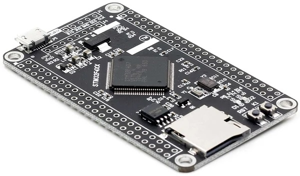

# CarIAPplayer

Author: Vincent Gijsen

Desclaimer: 
* software as is
* no warrenties whatsoever
* only for hobby purposes/,
 

## intro
Project to emulate a well-know music player, with eleborate integration option within car-multimedia systems and receivers.
I made this project for some special like-to-haves like use my car radio,to control some embedded logic,not as a drop-in replacement
If you feel you like this as a replacement for the original product, don't. its probably bugged, might set your car/receiver/.. on fire

## Hardare
I bought this "STM32F407VET6 STM32 System Core Board STM32F407 Development Board F407 Single-Chip Learning Board" from the well-known places.
it has usb and SDcard interfaces, as well as SWO and the 3wire programming capability with STlink, so no soldering required to get going

## State of project
is on-going development (until its no longer ;), at this point (28-03-2021), usb audio streaming with wav works,

next steps are 
1) ~~integrade HID descriptor~~
2) integrate HID logic (lingos)
3) test...
4) state machines for
 * playback
 * meta-data
 * remote control
 * ...

## Highlights:
* composite stm32cubeied with stm32f407vet
* audio out (Audio Class) device
* hid (input through ep0, out via bulk 0x83)
* wav ('decoding') working, Flac, present (yet bugged somehow)
* reading data from SDcard (via SDIO interface), with fat32

## references
higly inspired by initiatives like / borrowed code from:

* https://github.com/oandrew/ipod-gadget
* https://github.com/dragonman225/stm32f469-usbaudio/
* https://github.com/Sid346/WAV-Player
* https://mackron.github.io/dr_flac.html

pleanty more..
